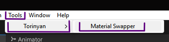
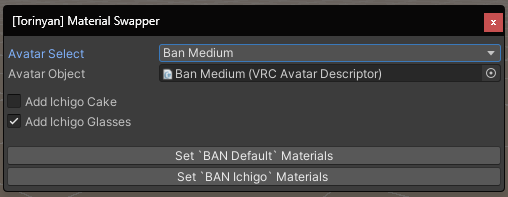
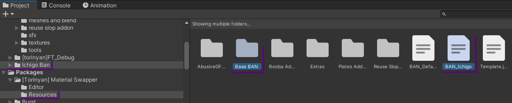

# VRChat Avatar Material Swapper

This tool was made by the Torinyan team to help people swap their avatar materials quickly in-editor.  
It also allows creators to specify some addon prefabs that'll be placed as a child-object to the selected avatar.

## End-User How-To

1. Open the tool via `Tools` > `Torinyan` > `Material Swapper`  
  
2. Select your avatar, either via the select box, or the drag&drop input
3. Select any addons you want to add to your avatar, if there are any
4. Click the button for the material you wish to swap to  
  
5. Done

## Material Creator How-To

1. Duplicate (`Ctrl`+`D` in Unity Editor) the template file  
  You can find the file here: `Assets/[Torinyan] Tools/MaterialSwapper/Template.json`  
  For the Torinyan avatar BAN you can duplicate `BAN_Default.json` instead
2. Rename the new file to whatever you like
3. Edit the new file in any text editor, even Notepad will do (Double-click the file in Unity Editor to open it)  
  Be sure to follow JSON formatting standards. You can test your file using a JSON-validator, like:  
  https://jsonlint.com/
4. Always test your work, better safe than sorry ^_^
5. Be sure you have the material definition file selected during your export  
  `Ctrl`+`Left Click` allows you to select multiple folders and files  
  
6. Be sure to notify your clientele that they can use this tool to swap their materials in seconds!

## Definition File Format

MaterialBindings:
| Name      | Type          | Required? | Comment                                      |
| --------- | ------------- | --------- | -------------------------------------------- |
| Name      | String        | Required  | Name shown in the material swap button       |
| DependsOn | String        | Optional  | Path of a file that the material depends on. |
| Addons    | AddonInfo[]   | Required  | List of addon prefabs                        |
| Bindings  | BindingInfo[] | Required  | List of material bindings (swaps)            |

AddonInfo:
| Name       | Type          | Required? | Comment                                             |
| ---------- | ------------- | --------- | --------------------------------------------------- |
| Name       | String        | Required  | Addon name shown in the tool UI                     |
| PrefabPath | String        | Required  | Addon prefab path                                   |
| InstallAt  | String        | Optional  | Where to add the prefab instance, defaults to root. |

BindingInfo:
| Name       | Type     | Required? | Comment                                           |
| ---------- | -------- | --------- | ------------------------------------------------- |
| PrefabPath | String   | Optional  | Prefab path that the material swap depends on.    |
| ObjectPath | String   | Required  | Relative path to the Mesh object                  |
| Materials  | String[] | Required  | List of materials (Ordered like in Unity Editor). |

Example:
```json
{
  "Name": "My Material Name",
  "DependsOn": "Assets/Some/Path/MyEpicAvatar.prefab",
  "Addons": [
    {
      "Name": "Checkbox Name",
      "PrefabPath": "Assets/Some/Path/MyEpicAddon.prefab",
      "InstallAt": "some/relative/path"
    }
  ],
  "Bindings": [
    {
      "ObjectPath": "apple",
      "Materials": [
        "Assets/AltStyle/materials/apple_1.mat",
        "Assets/AltStyle/materials/apple_2.mat"
      ]
    },
    {
      "PrefabPath": "Assets/Some/Path/MyEpicAddon.prefab",
      "ObjectPath": "MyEpicAddon/juice",
      "Materials": [
        "Assets/AltStyle/materials/juice.mat"
      ]
    }
  ]
}
```
